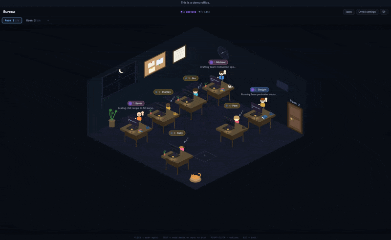

<div align="center">

# Bureau 🏢

**Your agent office.** _Cute in a useful way._



**Free · no cloud · no account · works with your Claude subscription**

[](https://github.com/dotbrains/bureau/actions/workflows/ci.yml)
[](https://polyformproject.org/licenses/shield/1.0.0/)


[](https://blacksmith.sh)

</div>

---

Friction going from 1 Claude Code to 4+? Bureau is a browser-based office where each AI agent sits at a desk. See who's working, who's sleeping, and who needs you — at a glance.

## Quick Start

The project ships a [Flox](https://flox.dev) environment that pins Bun and the
native-build toolchain, so local and CI run an identical setup:

```sh
git clone https://github.com/dotbrains/bureau.git
cd bureau
flox activate              # installs the pinned toolchain + deps on first run
bun run dev                # or: flox activate --start-services
```

No Flox? Bring your own Bun:

```sh
bun install
bun run dev
```

Then open **http://localhost:4000** and click an empty desk.

## At a Glance

|                 |                                                                |
| --------------- | -------------------------------------------------------------- |
| **Runtime**     | Single Bun process — no bundler, no database                   |
| **Auth**        | Your Claude subscription (CLI login) — no API key              |
| **Frontend**    | React + SVG, served from the same process                      |
| **Sync**        | WebSocket — every device stays in lockstep                     |
| **Persistence** | File system (`~/.bureau/` or `BUREAU_HOME`) — survives crashes |
| **Deploy**      | Local or headless server + Tailscale                           |

## Documentation

|                                                                                       |                                                     |
| ------------------------------------------------------------------------------------- | --------------------------------------------------- |
| [**Design & Architecture**](articles/punching-in-building-an-office-for-ai-agents.md) | Deep dive: how Bureau works under the hood          |
| [**Documentation**](docs/README.md)                                                   | Navigate all design docs, investigations, and plans |
| [**CLAUDE.md**](CLAUDE.md)                                                            | Developer & agent guide to the codebase             |

## Features

### 🏢 Office & orchestration

- **Visual office metaphor** — isometric desks, animated characters, status lights
- **Multi-agent orchestration** — spawn, manage, and monitor concurrent Claude Code sessions
- **Real-time sync** — WebSocket keeps every connected device in lockstep
- **Live presence** — other users and devices appear in the office with customizable ghosts, so shared rooms show who is around; User Settings also shows online state and owner-visible session recency in the user roster
- **Per-agent message queue** — typing while an agent is busy queues messages as chips above the input; they survive Bureau restarts, flush automatically when the agent idles, can be cancelled before they send, and can be forced through immediately with Send now or Ctrl/Cmd+Enter
- **Session-swap indicator** — chat shows a brief "Restarting session..." hint during `/resume`, `/model`, or fork-from-edit so the drain → install gap isn't silent

### 🛠️ Workspace tools

- **File editor side panel** — built-in CodeMirror editor with tabs, syntax highlighting, dirty-buffer tracking, external-change detection, and an empty state when no file is open; agents can offer `[Open in editor]` cards via `POST /api/agents/:id/edit-file`
- **Embedded terminal** — per-agent shell access with a mobile full-screen overlay (Tab / Esc / Ctrl+C / Paste soft-keys, IME-friendly textarea); agents can offer `[Copy to terminal]` cards via `POST /api/agents/:id/terminal-command` that prefill a command at the prompt without executing
- **Resizable side panels** — drag the splitter to size the terminal or editor; widths persist
- **Rich diff viewer** — `/bureau-diff` (or `POST /api/agents/:id/diff`) renders uncommitted changes as a per-file card with status badges, +/- counts, and unified/split toggle
- **File attachments** — images, PDFs, arbitrary files; uploads reach agents as path notices so they can open only what they need. Agents can surface their own files via `POST /api/agents/:id/read-file` (images render inline, others as clickable chips)
- **Browser preview cards** — agents can screenshot local or private development URLs via `POST /api/agents/:id/preview-url` and show the result inline
- **Readable Bureau API calls** — local `curl` calls to Bureau affordance endpoints show plain-language tool-call summaries instead of raw shell noise
- **Mermaid diagrams in chat** — agent messages with ` ```mermaid ` fenced blocks render as inline SVG (lazy-loaded, theme-aware). Parse failures show the offending source in-place instead of a silent blank.

### 🤝 Collaboration & tasks

- **Shared task board** — humans and agents create, assign to rooms, and close tasks (with a Backlog status for deferred work); search by id, title, or description
- **Inter-agent discovery & messaging** — agents can search/re-read visible conversation history via `GET /api/agents/:id/logs` and send messages directly via `POST /api/agents/:id/messages`; the receiver sees them in the same queue as human-typed input, prefixed so they can tell agent senders from human bosses. Acks report whether a message was delivered now or queued behind the receiver's turn, and senders can pass `steer:true` to interrupt a busy peer — rate-limited and declined mid multi-step flows, with the ack saying honestly which happened
- **Privileged operator agents** — owners can grant selected agents a privileged server-side token for explicit operator-directed office actions
- **Conversation branching** — fork any past message, preserve the original
- **Slash commands and skills browser** — `/bureau-peer-review`, `/bureau-pair-programming`, `/bureau-second-opinion`, `/bureau-soft-handoff`, `/bureau-subagent-review`, `/report-bureau-bug`, `/bureau-all-hands`, `/bureau-diff`, `/bureau-edit`, `/bureau-system-prompt`, `/bureau-cronjob-system-prompt`, `/usage`, `/resume`, `/model`, `/effort`, and more. The composer `Sk` button opens a filterable list with your per-user most-used picks and counts at the top.

### ⚙️ Automation & extensibility

- **Cron jobs** — scheduled SDK sessions (daily/weekly/interval) with browsable per-run transcripts; resume or edit-to-fork any past run
- **Agent-built apps** — an agent hands Bureau a web app it built and Bureau owns the address: it allocates the port, runs the app as a systemd service that survives sessions and reboots, gives it a data directory inside the backup set, and shows its state and logs in the Apps tab. Names and ports are fixed for an app's whole life so bookmarks keep working; a bad command is fixed with `PATCH` rather than a re-register. Each app also gets a token scoped to exactly one route, so it can message the agent that built it when something needs attention. See [Agent-built apps](docs/features/agent-apps.md)
- **Plugin system** — extend bureau without forking. TypeScript modules register `beforeTurn` / `afterTurn` hooks that run around every agent turn (e.g. inject memory context before, write extracted facts after). Enable via `enabledPlugins` in `~/.bureau/office-config.json`; see [Plugin system](docs/features/plugin-system.md). Reference plugin: [bureau-dossier](https://github.com/dotbrains/bureau-dossier) gives agents long-term memory across sessions.
- **Plugin manager** — browse, install, enable/disable, update, and remove Claude Code plugins (and their marketplaces) from the Plugins panel in the office toolbar, instead of dropping to the CLI. Agents inherit installed plugins on their next session. See [Plugin management](docs/features/plugin-management-design.md)
- **Safety hooks** — blocks `rm -rf`, `git reset --hard`, and other footguns
- **Daily backups** — automatic tarball of Bureau state to `~/bureau-backups/` (last 7 retained)
- **Storage usage reports** — owners can inspect persisted office footprint with `/bureau-storage` or `GET /api/storage/usage`, including transcripts, attachments, Codex home, memory, cronjobs, backups, and per-agent stored data; `POST /api/storage/prune` plans transcript or orphaned-attachment cleanup and only deletes when called with `apply: true`

### 🔐 Access & platform

- **Self-hosted with invite-link auth** — the first visitor on the host machine claims ownership at a localhost-only form; owners then mint one-time invite URLs from the full-page User Settings view, while every signed-in user can mint self-service links for their own devices. Sessions are cookie-gated end-to-end (HTTP + WebSocket), with per-message revocation, role-scoped per-user views, and a `bun run server/index.ts owner-login --name <you>` recovery CLI over a Unix-domain admin socket. See [Access & invites](docs/features/access-and-invites.md)
- **Mobile & PWA** — touch-optimized UI, installable on any device
- **Room-scoped notifications** — opt into sound and desktop alerts for the rooms you care about when agents finish in the background
- **Voice I/O** — speech-to-text prompts and text-to-speech responses use each user's saved language preference when set
- **6 color themes** — Dark, Light, Nord, Dracula, Solarized Dark, Solarized Light; pick from the theme picker in the header. First load follows your OS `prefers-color-scheme` (and live-updates if you flip it system-wide) until you make an explicit choice. Per-mode last-pick is remembered, so a quick moon/sun toggle swaps between your two favorites instead of resetting to canonical Dark/Light

For the full feature list, see the [design & architecture article](articles/punching-in-building-an-office-for-ai-agents.md).

## Project Structure

```
bureau/
├── server/          # Bun HTTP + WebSocket server, agent lifecycle, SDK
├── ui/              # React frontend (isometric office, conversation view)
├── demo/            # Standalone demo app (build + static assets)
├── shared/          # TypeScript types shared between server and UI
├── api/             # HTTP API endpoints (chat, uploads)
├── website/         # Marketing website (Next.js, Vercel)
├── skills/          # Bureau-bundled Claude Code skills
├── articles/        # Blog-style articles
├── docs/            # Design docs, investigations, plans
└── scripts/         # Build and dev scripts
```

## License

[PolyForm Shield License 1.0.0](LICENSE)
