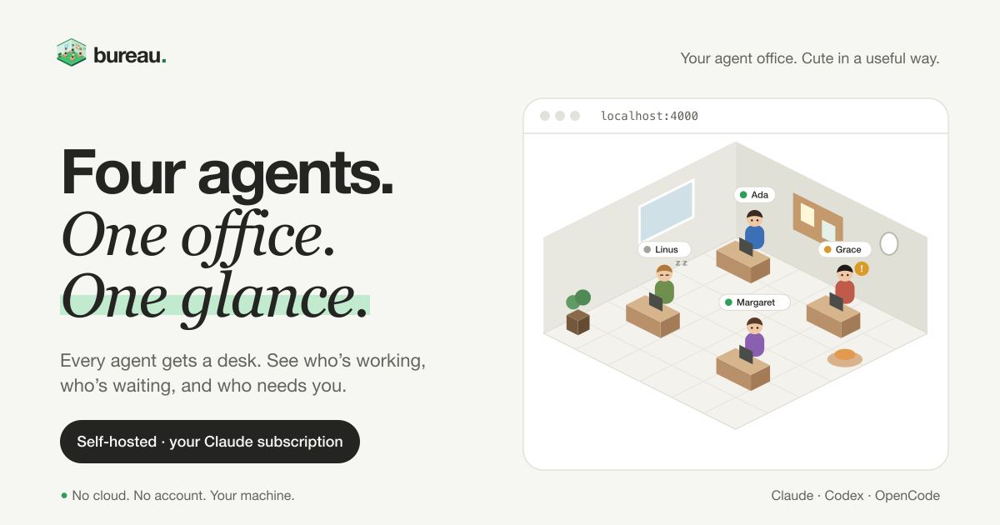

# Bureau 🏢

**Your agent office.** _Cute in a useful way._

[](https://bureau.smeltery.io)

**Free · no cloud · no account · works with your Claude subscription**

[](https://github.com/smeltery/bureau/actions/workflows/ci.yml)
[](https://polyformproject.org/licenses/shield/1.0.0/)


[](https://blacksmith.sh)

---

Friction going from 1 Claude Code to 4+? Bureau is a browser-based office where each AI agent sits at a desk. See who's working, who's sleeping, and who needs you — at a glance.


## Quick Start

The project ships a [Flox](https://flox.dev) environment that pins Bun and the
native-build toolchain, so local and CI run an identical setup:

```sh
git clone https://github.com/smeltery/bureau.git
cd bureau
flox activate              # installs the pinned toolchain + deps on first run
bun run dev                # or: flox activate --start-services
```

No Flox? Bring your own Bun:

```sh
bun install
bun run dev
```

Then open **http://localhost:4000** and click an empty desk.

## At a Glance

|                 |                                                                |
| --------------- | -------------------------------------------------------------- |
| **Runtime**     | Single Bun process — no bundler, no database                   |
| **Auth**        | Your Claude subscription (CLI login) — no API key              |
| **Frontend**    | React + SVG, served from the same process                      |
| **Sync**        | WebSocket — every device stays in lockstep                     |
| **Persistence** | File system (`~/.bureau/` or `BUREAU_HOME`) — survives crashes |
| **Deploy**      | Local or headless server + Tailscale                           |

## Documentation

|                                                                                       |                                                     |
| ------------------------------------------------------------------------------------- | --------------------------------------------------- |
| [**Design & Architecture**](articles/punching-in-building-an-office-for-ai-agents.md) | Deep dive: how Bureau works under the hood          |
| [**Documentation**](docs/README.md)                                                   | Navigate all design docs, investigations, and plans |
| [**CLAUDE.md**](CLAUDE.md)                                                            | Developer & agent guide to the codebase             |

## Project Structure

```
bureau/
├── server/          # Bun HTTP + WebSocket server, agent lifecycle, SDK
├── ui/              # React frontend (isometric office, conversation view)
├── demo/            # Standalone demo app (build + static assets)
├── shared/          # TypeScript types shared between server and UI
├── api/             # HTTP API endpoints (chat, uploads)
├── website/         # Marketing website (Vite + React, Vercel)
├── skills/          # Bureau-bundled Claude Code skills
├── articles/        # Blog-style articles
├── docs/            # Design docs, investigations, plans
└── scripts/         # Build and dev scripts
```

## License

[PolyForm Shield License 1.0.0](LICENSE)
