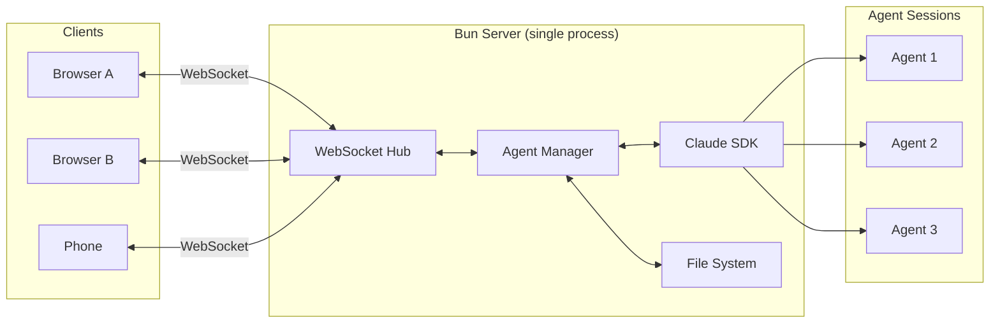
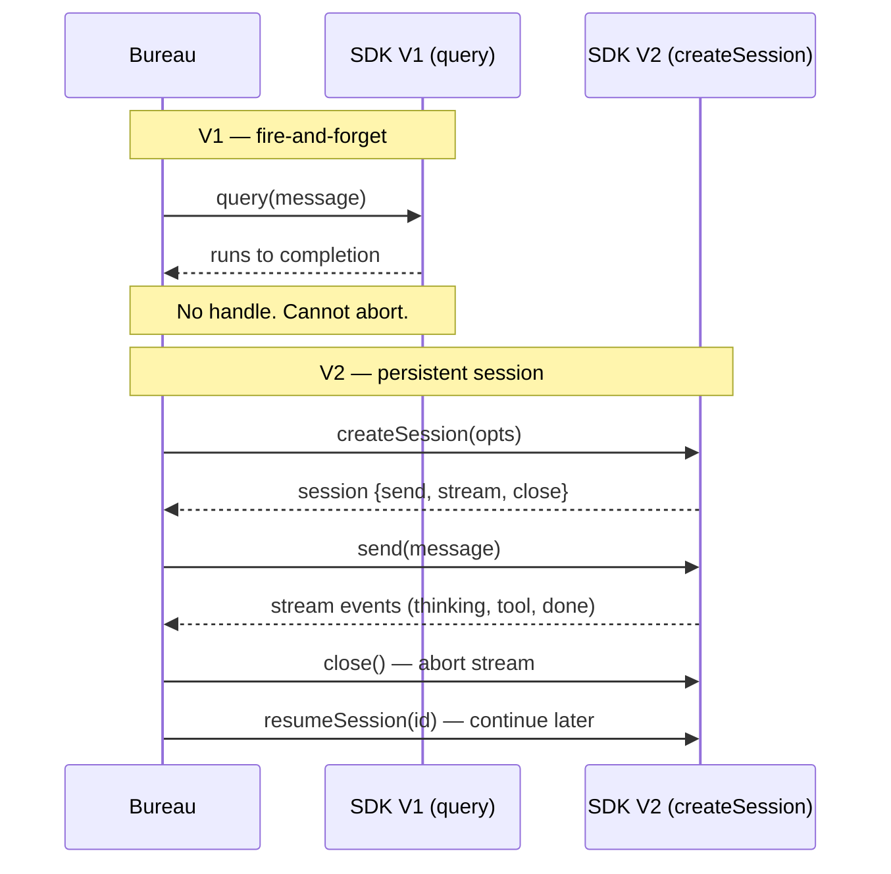
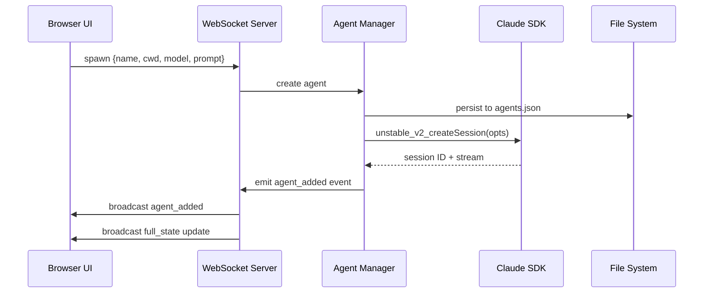
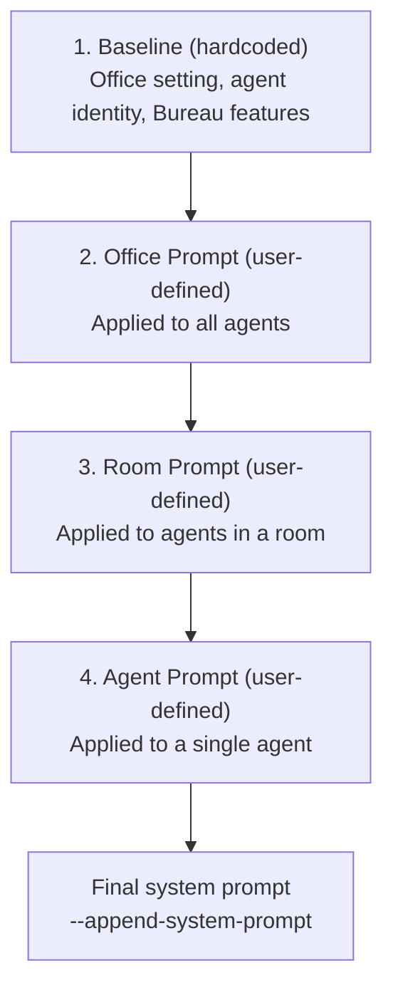
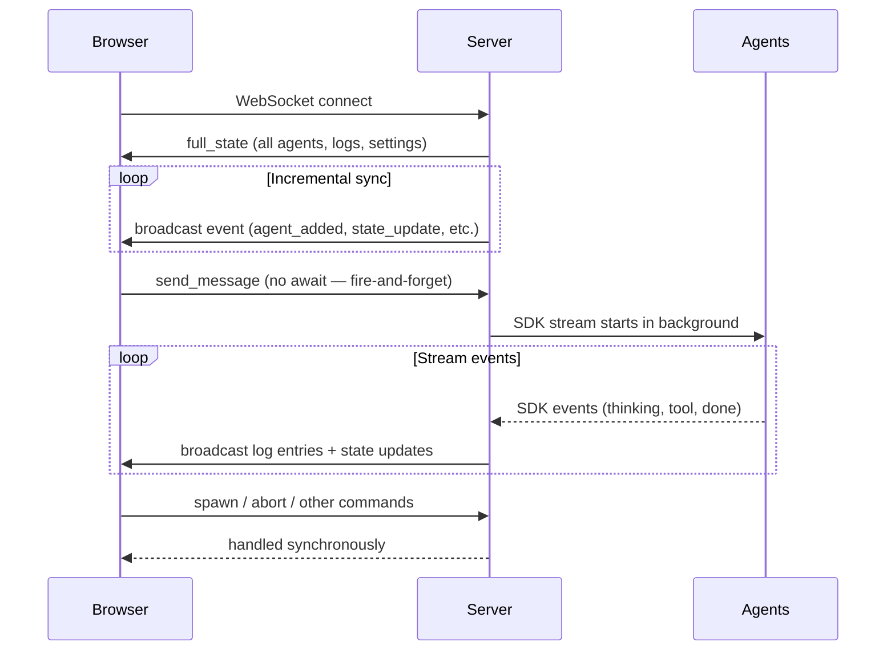
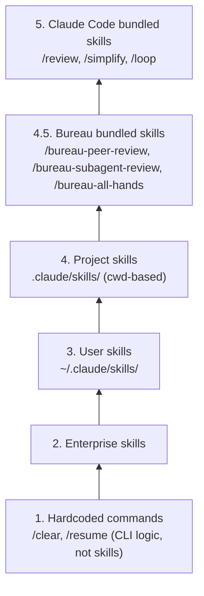
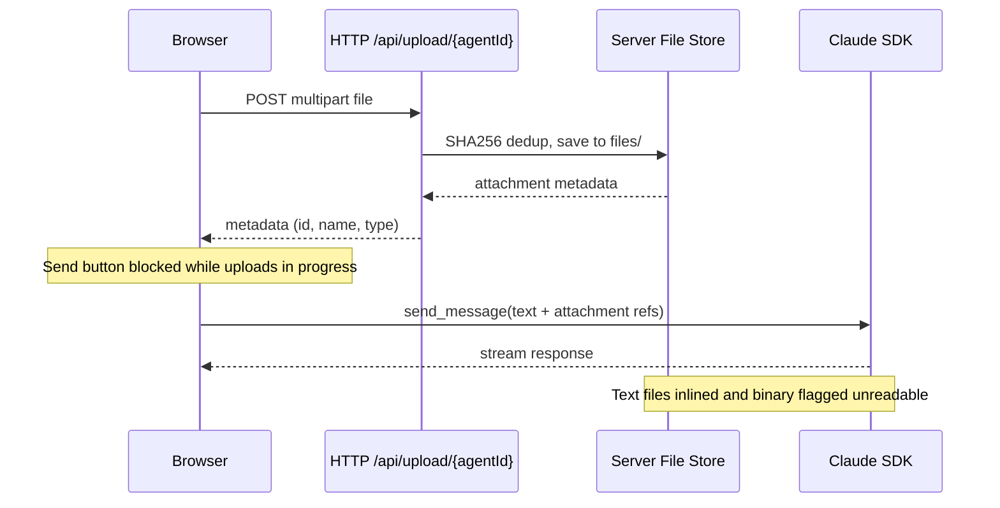
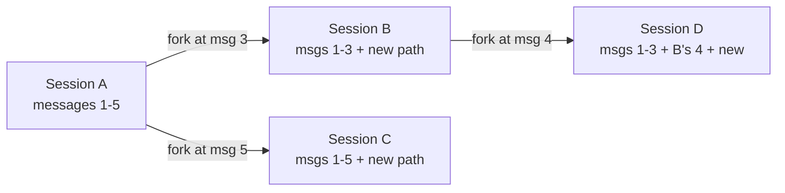
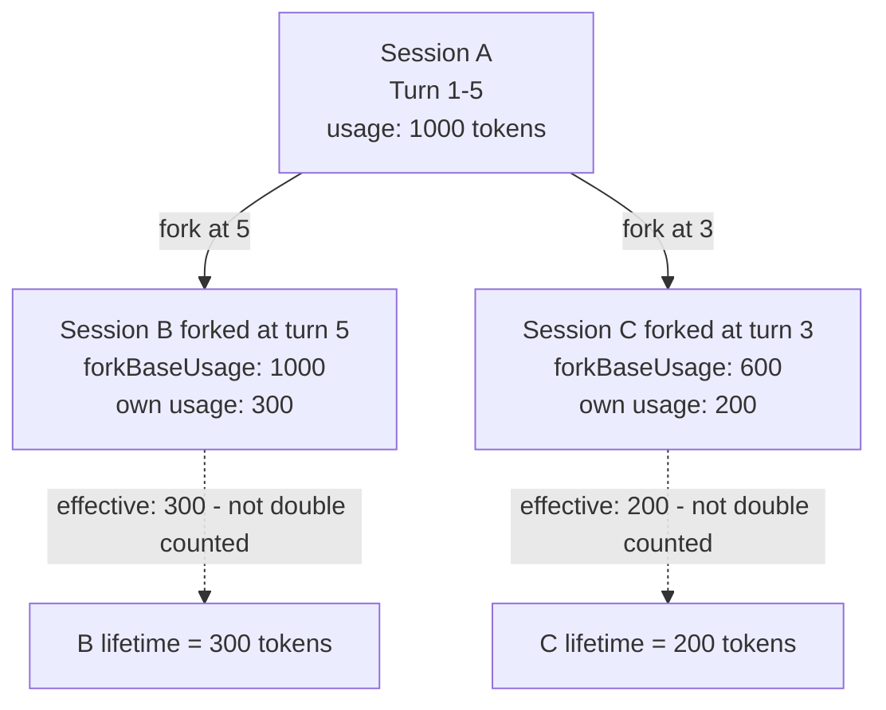

# Punching In: Building an Office for AI Agents


The main friction with scaling from a single Claude Code session to 4+ concurrent agents was terminal management, especially for tasks that can only be done remotely, like model training.

Tmux helped; cmux was even better. But trying to keep good uptime on multiple agents felt cramped.

What actually solved it was:

1. Building a browser-based agent orchestration tool.
2. Running it on a persistent server inside a Tailscale network with laptop and phone access.

This simplifies both ends of the workflow:

- What device you're on: all devices see the same agents and conversations.
- Claude's environment: all agents run on the same machine.

Two great things not to have to worry about.

Bureau (short for "your agent bureau") fills this gap. It's an isometric 2D office UI where each agent sits at a desk with a customizable name and look. You see who is working, who's sleeping, and who has their hand raised at a glance.

The thesis is that **by anthropomorphizing agents, we reduce cognitive load**; we're more used to coordinating humans than terminals.

## Architecture Overview

Bureau is a **single Bun process** that:

- serves the browser frontend,
- talks to browsers over WebSocket,
- manages agent lifecycles,
- and runs Claude Code sessions with the Agent SDK.



## How the Claude Agent SDK Works

The Claude Agent SDK lets you run Claude Code sessions programmatically from JavaScript. You create a session, send messages, and get responses. It works with your existing Claude subscription — you just need to be logged in with the `claude` CLI tool (`/login`).

But unlike a simple request/response API, the SDK gives you a **stream of events**.

When you send a message, you don't get a single response back. You get events over time: "assistant started thinking," "assistant wants to use a tool," "tool produced output," "assistant is done."

A single user message can trigger a stream that lasts minutes. The SDK exposes this as an async iterator you read in a loop.

Sessions have an ID. If your application crashes or restarts, you can resume a session by its ID and the conversation history carries over.

### V1 vs V2

As of April 2026, the SDK has two versions. V1 (`query()`) is a fire-and-forget async call: you send a message and it runs to completion. There's no handle to grab, so there's no way to interrupt it.

V2 (`unstable_v2_createSession`) gives you a persistent session object with `send()`, `stream()`, and `close()`.

This makes abort possible: call `close()` to kill the stream, then `resumeSession(sessionId)` to resume that same stream again, perhaps with a new user message at the end.

Bureau needs the ability to abort agents (e.g., the user does Ctrl+C to add, "Sorry, I meant..."), so it uses V2 even though it's in alpha.



For now, V2 seems a bit buggy. Sometimes, the message order gets fumbled. SDK bugs are investigated and worked around as they appear.

## The Agent Lifecycle

### Spawning agents

When you click an empty desk to spawn an agent, you can provide:

- a name,
- a working directory (`cwd`), which is important for things like `CLAUDE.md`, git context, and MCP servers defined in that directory,
- a model,
- an agent-specific system prompt

The browser sends a `spawn` command to the server, which:



1. Initializes the SDK session,
2. Emits an `agent_added` event to all browsers.

Claude SDK's V2 `SDKSessionOptions` doesn't expose a field for `appendSystemPrompt`. Bureau works around this by smuggling the flag through `executableArgs`, which the SDK prepends to the Claude binary's argv:

```typescript
// server/agent-manager.ts
function createSession(managed, resumeSessionId) {
  const opts = {
    model: managed.info.model,
    cwd: managed.info.cwd,
    permissionMode: managed.info.permissionMode,
    pathToClaudeCodeExecutable: CLAUDE_NATIVE_BIN,
    executableArgs: ["--append-system-prompt", buildSystemPrompt(...)],
    hooks: createSafetyHooks(),
  };
  return resumeSessionId
    ? unstable_v2_resumeSession(resumeSessionId, opts)
    : unstable_v2_createSession(opts);
}
```

The system prompt is rebuilt on every `createSession` call, so office/room/agent prompt edits automatically land on the next conversation.

### Agent identity

The system prompt is assembled from **four hierarchical layers**, concatenated into a single string and injected into the Claude Code CLI subprocess via the `--append-system-prompt` argument:



1. **Baseline**: hardcoded context explaining the office setting, the agent's identity (name and room), and Bureau features.
2. **Office prompt**: user-defined, applied to every agent in the office.
3. **Room prompt**: user-defined, applied to every agent in a given room.
4. **Agent prompt**: user-defined, applied to a single agent.

The baseline is designed to be brief, but leaves breadcrumbs so the agent can load in more state if it needs to. Each non-baseline layer is optional; empty ones are skipped entirely.

The room layer lets you group agents by project or role: e.g., you could have a room for your day job and a room for your side projects; each room may need different context, hence the room-wide prompt (you can even have different environment variables per room).

The full system prompt looks like this:

```
You are AGENT_NAME, an agent in room ROOM_NAME of the Bureau office.
Your goal is to help the office boss, who talks to you in this chat.
Messages are prefixed with the boss's name in brackets.

How to discover other office agents and their conversation logs: read
~/.bureau/agents-summary.json.

How to use the task board (localhost:4000/tasks): only touch it when the boss asks. When you do:
  curl -s localhost:4000/tasks                                          # list open tasks
  curl -s localhost:4000/tasks?status=all                               # include done
  curl -s -X POST localhost:4000/tasks -H 'Content-Type: application/json' \
    -d '{"title":"...","createdBy":"AGENT_NAME"}'                       # create
  curl -s -X POST localhost:4000/tasks/ID/claim -H 'Content-Type: application/json' \
    -d '{"assignee":"AGENT_NAME"}'                                      # claim
  curl -s -X POST localhost:4000/tasks/ID/done -d '{}'                  # mark done
Optional fields on create/update: description, priority (P0-P3), assignee.

How to show an image to the boss: read the image file with the Read tool — it renders inline in the conversation.

How to answer questions about Bureau itself: the source lives at https://github.com/dotbrains/bureau. Read the README and the relevant code under server/, ui/, shared/, docs/ before answering.

## Office Instructions

USER_DEFINED_OFFICE_WIDE_SYSTEM_PROMPT

## Instructions For Your Room: ROOM_NAME

USER_DEFINED_ROOM_SYSTEM_PROMPT

## Personal Instructions For You: AGENT_NAME

USER_DEFINED_AGENT_SPECIFIC_SYSTEM_PROMPT
```

In the agent summary document, each agent can find metadata about itself and every other agent:

```json
// ~/.bureau/agents-summary.json

{
  "id": "agent-1774819851476-qmpf",
  "name": "PersonalSiteAgent",
  "desk": 7,
  "room": 1,
  "topic": "Write technical blog post about bureau",
  "cwd": "~/my-project",
  "model": "claude-opus-4-6",
  "logDir": "~/.bureau/logs/agent-1774819851476-qmpf"
}
```

Further, through the `logDir` paths, each agent has access to the current conversation of every other agent (i.e., since the last `/clear`, which works per-agent).

This means you can ask an agent, *"What do you think of OTHER_AGENT's approach?"* and it just works.

### Agent persistence

The file system is the source of truth. If the server crashes, nothing is lost (agents constantly restart their own server while building Bureau, and pick conversations right back up).

The `~/.bureau/` folder contains:

- `agents.json`: full agent config, including things like the outfit choices and the agent-specific system prompt.
- `agents-summary.json`: a lightweight version linked to all agents in their system prompt, so they can discover each other.
- `logs/{agentId}/{sessionId}.jsonl`: append-only JSONL files for conversation history. Each line is a `LogEntry`.
- `office-prompt.txt`: user-defined office-wide system prompt injected into all agents.
- `tasks.json`: shared task board (JSON array of tasks with status, priority, and assignee).
- `recent-cwds.json`: recently used working directories (for autocomplete in the spawn dialog)

These files are kept consistent with the state sent to the clients.

When a browser first connects, it receives a full snapshot of the office containing the settings of every agent, their logs, and office-wide settings.

On server restart, agents are restored from `agents.json` and their SDK sessions are recreated.

Past conversations can be resumed from the JSONL logs with `/resume` or by right-clicking an agent. This makes the `/resume` interaction per-agent, unlike in Claude Code.

Bureau persists every conversation forever by design. You never know when it could be useful.

### The SDK stream event loop

Bureau reads each agent's event stream in an async loop, converting SDK events into two things browsers care about: **log entries** for the conversation view, and **agent state** for the character animations and notifications (thinking, tool calling, waiting, etc.).

## The WebSocket Layer

Browsers are stateless relays — when one connects, the WebSocket `open` handler sends it a `full_state` snapshot, and from there incremental events keep it in sync.



The server talks to connected browsers via web sockets.

- The server notifies all browsers of state updates via a single `broadcast` function.
- The clients give commands to the server, which are handled in `handleCommand()`:

The `send_message` command — where a user sends a message to the LLM — is deliberately not awaited. Calling it without `await` kicks off the async work and returns immediately, so the event loop stays free to process other commands (spawns, aborts, messages to other agents, etc.) while the SDK streams the response in the background. Most other command types are handled synchronously.

## The Frontend

### Office rooms

The office groups agents into rooms of at most 8; extra agents have to go in different rooms. It's designed so Tab and Shift+Tab for agent cycling stays within a room, as cycling through more than 8 conversations would be overwhelming.

In the first room, you keep 3-5 agents for your main project, as well as 1 agent for each of your other projects you touch often. If an agent has no active conversation (it's been `/clear`ed), it's skipped from cycling.

You can also have agents for non-coding things, like a job search.

If you know you're not going to touch a project for a while, you move the agent(s) to a different room, so they are out of sight.

### Skeuomorphic elements

Leaning into the office visuals:

- Click the corkboard to open the office's task board.
- Click the framed sign on the wall to edit the "office rules" (the office-wide system prompt).
- Opus agents have a book; Haiku agents have crayons.
- Click the moon through the window to toggle dark mode.

The agent customization helps with anthropomorphizing.

### SVG graphics

The entire isometric scene was generated by Opus — ~1,600 lines of raw coordinates, bezier curves, and animate tags. No libraries, assets, or tools were used.

The highlight is the neon sign. It one-shotted the skewed font, the light "diffusion", and the atmospheric flickering. Ligatures between letters were added for realism, and the first intuition for their positioning and shape was already spot on.

That said, Opus's SVG capabilities are a lot more spiky than coding. It sometimes fails and thrashes at trivial tasks, like moving the window a few pixels over.

### Redux-Like Store

The React frontend uses a `useReducer` store where **server messages are actions**. The same `ServerMessage` types that flow over the WebSocket are dispatched directly into the reducer.

This eliminates the usual action-creator boilerplate. Adding a new server event type automatically works end-to-end: define the message on the server, add a case to the reducer, done.

The store also manages local-only state: input drafts (preserved when switching between agents), attention tracking, and the focused agent.

### Mobile app

The office layout is optimized for phone screens. On mobile, Tab and Shift+Tab are replaced by left and right swipe gestures.

An optional agent list view is available for small screens, in case the isometric scene is too small.

There's no native app yet, but you can use a browser feature that gets 80% of the way there: go to the frontend on your browser, then in the browser menu, find the option "Add to home screen." This turns the website into a "Web App."

## QoL Features

So far, we described a working architecture, but that's only half of the work; the other half is making it a place you actually want to spend 8 hours a day.

Things like autocomplete on slash commands, an embedded terminal, or recent CWD suggestions when spawning an agent, start to matter a lot.

### Safety Hooks

Bureau injects `PreToolUse` hooks into every SDK session that block dangerous commands before they execute.

1. **Git safety**: blocks destructive git commands.
2. **Filesystem safety**: blocks `rm -rf` on root/home paths while allowing it on temp directories.
3. **Bureau config protection**: blocks all writes to `~/.bureau/`, since that directory is managed by the server. Read operations are allowed (agents need to read `agents-summary.json` to discover each other).
4. **Secrets protection**: blocks reads of `.env` files, private keys, and credential files (agents get a clear error and a hint to ask the user instead).

The embedded terminal is very handy when you need to run one of the blocked commands.

### Skills

In Claude Code, skills can come from a few places, some hardcoded and some discovered dynamically. There is a hierarchy that determines which one you see if there's a name clash. From highest to lowest priority:



In addition to dynamically fetching all these skills (except Enterprise), Bureau adds its own tier of **bureau-bundled skills**:

- `/bureau-peer-review`: tells the agent to read the ongoing conversation with another agent and give feedback.
- `/bureau-subagent-review`: spawns a subagent to review uncommitted changes for bugs and principled-vs-hacky before committing.
- `/bureau-all-hands`: shows what everyone is working on.
- `/bureau-system-prompt` and `/bureau-cronjob-system-prompt`: dump the full assembled system prompt for the agent (or a named cron job) so the user understands what behavior the office has actually been wired up to produce.
- `/bureau-edit <path>`: pops a file open in the editor side panel — relative to the agent's cwd, absolute, or `~/...`. Agents can offer the same card via `POST /agents/:id/edit-file`.

### Plugin hooks

Several plausible integrations — memory layers, observability, redaction, audit — want to sit in the agent turn loop without each one needing a fork. Bureau exposes one extension point for that: a TypeScript plugin module exports `beforeTurn` and/or `afterTurn` hooks, and a central `runAgentTurn` helper fires them for every turn that comes out of `sendMessage`, the queue flush, a skill execution, or an `editMessage` fork resend.

`beforeTurn` can return a `promptPrefix` string that the hook bus wraps in `--- begin plugin: <id> ---` / `--- end plugin: <id> ---` delimiters and prepends to the outgoing prompt. Multiple plugins' blocks concatenate in alphabetical id order. `afterTurn` observes the turn outcome (`completed` / `failed` / `interrupted`) along with the assistant's text and the slice of log entries produced during the turn. Per-plugin timeouts (5s before, 10s after) keep one slow plugin from blocking the chat.

Plugins are enabled per office by listing them in `~/.bureau/office-config.json`'s `enabledPlugins` array — bare string ids for bundled plugins under `<bureauRoot>/plugins/<id>/`, and `{id, path}` objects for external plugins at an operator-controlled location. There is no directory scanning; the config is the trust boundary.

The trigger use case is wiring a memory layer like mem0: `beforeTurn` queries the vector store with the user's text and prepends retrieved facts; `afterTurn` writes new facts extracted from the turn. The plugin system itself is the long-lived investment — any individual integration is throwaway.

### Voice prompting

One advantage of the frontend being browser-based is that we can leverage the existing voice-to-text and text-to-speech APIs for prompts and responses, respectively.

The only issue with voice-to-text is that Chrome won't let you use it if over HTTP unless it is in localhost. This is fine when running Bureau locally, as you access it on localhost:4000, but has an annoying interaction with Tailscale.

With Tailscale, you access Bureau at port 4000 of the server's localhost instead of your own, which is inside the Tailscale network. However, Chrome doesn't care about that and still blocks it.

The workaround is to get a TLS certificate for your server and connect through it.

### Attention tracking and notifications

The attention system is simple but effective. An agent "needs attention" when it transitions from a working state to a terminal state while the user is looking at a different agent.

On the office view, agents needing attention get a pulsing indicator. Combined with sound notifications (when the browser tab is hidden), you never miss when an agent finishes or gets stuck.

### Auto-generated conversation topics

Each agent displays a short topic below its nametag, like "Fixing auth middleware tests" or "Refactoring WebSocket layer."

What's interesting is how they're generated. When the first user message comes in, the server fires off a `unstable_v2_prompt()` call behind the scenes. It builds a context snippet from the first user message (and the last few, if the topic is regenerated later) and then asks for a topic in 8 words or less.

Orchestration tools should be mindful with server-initiated prompts like this. They spend user tokens doing something that's not directly answering the user.

In this case, it's a trivial amount, but a cheaper model (Sonnet) is still used.

The topic is included in the agent manifest, helping agents know what others are up to. It is also persisted per-session in `sessions.json`, so it survives server restarts and shows up when browsing past sessions to resume.

### Shared task board

Agents and humans share a task board. Anyone can create, assign, claim, and close tasks, from the UI or from agents via HTTP.

Agents interact with the task board through a simple HTTP API (`GET /tasks`, `POST /tasks`, `POST /tasks/:id/claim`, `POST /tasks/:id/done`). The system prompt includes curl examples so they know how without being told. Tasks are persisted to a flat JSON file. Bun's single-threaded event loop handles concurrency naturally; no locking needed.

### File attachments

This feature goes two ways: (1) the agent showing us images, and (2) the user showing files to the agent.

For (1), imagine that we ask the model to make a plot and show it to us. The model can write a Python script with matplotlib and generate a .png. But then, how does it show it to us?

The easiest way found was to display images inline in the conversation as a side-effect whenever the model calls the file read tool. In the system prompt, we had to explicitly tell the agent about this, since it's not obvious from the point of view of the model:

> To show an image to the boss, read the image file with the Read tool — it renders inline in the conversation.

For (2), the SDK's user message format natively supports image and PDF content blocks, so a file-attachment feature was added to match that.

The upload path itself: files never travel over the WebSocket — only metadata does.



The browser sends files via multipart HTTP POST to `/api/upload/{agentId}`, and then the server saves them to a per-agent `files/` directory (SHA256-deduped) and returns attachment metadata. On the frontend, the "send" button is blocked while uploads are in progress.

When it's time to send the actual SDK message to Claude, the text and attachment references are combined.

Since the upload-to-server path was already there, it was extended to support arbitrary file types. Text-detectable files (by extension) are inlined as text blocks; everything else is uploaded but flagged as unreadable (with a note for the model not to infer the content). This is useful in the remote-server setup, for transferring files to the server without needing a separate tool (like `scp`).

### Conversation branching

Sometimes you send a message and wish you'd phrased it differently. In Bureau, you can click edit on any past user message to fork the conversation from that point.

The SDK has a `forkSession` function that copies a session transcript up to a given message. For the edge case of editing the very first message, there's no predecessor, so we just start a fresh session.



Each session's JSONL only stores its own entries. When displaying a forked session, the UI walks the `forkedFrom` chain and assembles the full history from ancestors at display time — no data duplication.

A key decision was how to handle logs. Since we want to preserve the existing conversation, we can't just delete all posterior messages. Instead, we create a new session. The naive approach is to copy all the parent entries into the fork's JSONL file. But that duplicates data, which inflates disk usage and pollutes search results. Instead, each session's JSONL only stores its own entries. When displaying a forked session, we walk the `forkedFrom` chain in `sessions.json` and assemble the full history from ancestors at display time. Chain depth is typically 1-2 levels, so the overhead is negligible.

When looking at the list of past conversations to resume, forked sessions get a `↳` prefix, and sessions that have been branched from are dimmed with a "(branched)" label.

#### Fork-aware usage accounting

Bureau has a custom `/usage` command that renders a table with current-session and lifetime usage for each agent.

The SDK reports two flavors of accounting on each `result` event, and they don't behave the same way:

- **Tokens** (`input_tokens`, `output_tokens`, cache fields) are **per-turn deltas**. You have to sum them across turns to get a session running total.
- **Cost** (`total_cost_usd`) is cumulative-for-this-process. Overwriting it each turn is correct within a run, but **it resets to 0 on session resume** (resume spawns a fresh process).

So we persist two buckets per session: `usage` for the current run (tokens accumulated, cost overwritten) and `priorRunsUsage` for completed runs, rolled up when a resume happens. Session lifetime is their sum.

Forks add another wrinkle. When Session B forks Session A at turn 5, some of A's accounting leaks into B's first reported turn. To avoid double-counting when summing across sessions, we record the parent's usage at the fork point as `forkBaseUsage` on the child and subtract it.



Getting "cumulative at the fork point" means looking up the snapshot right before the fork point, so we save a snapshot after every turn for exactly this.

## Reproducible Toolchain with Flox

A single-Bun-process project sounds like it has no toolchain to speak of — install Bun, `bun install`, done. But "install Bun" hides a version, and the moment CI runs a different Bun than your laptop, you get the classic "works on my machine" failures: a formatter that disagrees by a Bun release, a test that passes locally and flakes in CI. There's also one native dependency hiding in the tree — `node-pty`, which powers the embedded terminal — and it compiles a C++ addon on `bun install`, so it quietly needs Python, make, and a compiler present.

So Bureau pins its whole toolchain with a [Flox](https://flox.dev) environment, checked into the repo at `.flox/env/manifest.toml`. Flox is a Nix-backed environment manager: the manifest declares exactly what's on `PATH`, and a lockfile freezes it across macOS and Linux, arm64 and x86.

```toml
[install]
bun.pkg-path = "bun"
bun.version = "1.3.13"          # one version, locked for local *and* CI
python3.pkg-path = "python3"     # so bun install can build node-pty
gnumake.pkg-path = "gnumake"
gcc.pkg-path = "gcc"
gcc.systems = ["aarch64-linux", "x86_64-linux"]
```

`flox activate` drops you into a shell with that exact toolchain (and an on-activate hook runs `bun install` on first entry). There's also a `bureau` service, so `flox activate --start-services` brings up the full `bun run dev` watch loop.

The part that actually pays off is CI. The five-job quality gate used to install Bun with a `setup-bun` action pinned to `latest` — a moving target that could drift from whatever each developer happened to have. Now every job runs `flox activate -- bun run …`, so CI and your laptop execute byte-identical tooling. There's no second place to bump the version; you edit one line in the manifest, re-lock, and both follow.

The one tax is that activating a Nix environment in CI means materializing its closure — Bun, the compiler, their dependencies. The fix is the same trick the rest of the system leans on: cache it. The Nix store is cached keyed on the environment lockfile, and `node_modules` keyed on the Bun lockfile, so a warm run restores the toolchain instead of re-downloading it and self-invalidates the instant either lock changes.

## Final Thoughts

It's great to have your own malleable orchestration tool. Oh, you don't like Claude Code's plan mode? No problem, you can roll out your own version.

Even if nobody else uses Bureau, it provides a ton of value. There's no feature pulling you back to raw Claude Code.

That said, Bureau — especially with Tailscale — can provide real value to people going from a single agent to multi-agent workflows.

The gap going from Level 1 to Level 5 was mostly about models getting smarter. But for 5 to 6, the orchestration tool matters more.

We'll all be working with agents, so it's important to really like your orchestration tool. The orchestration tool is the new editor.
