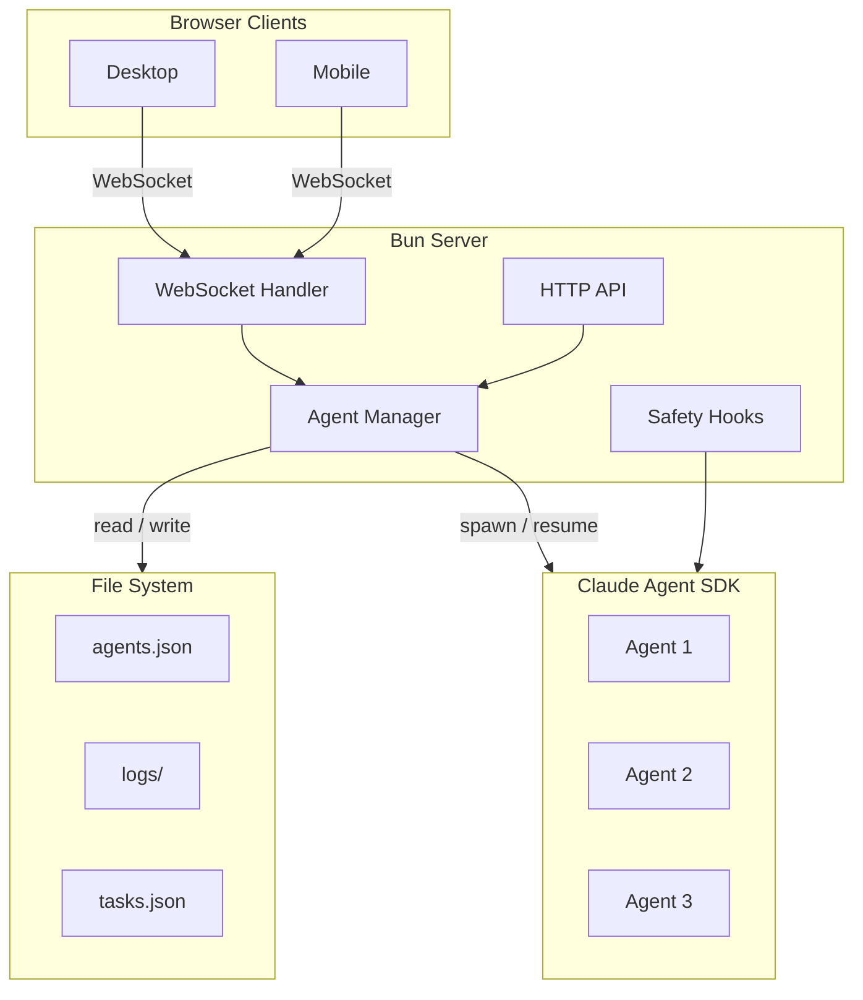

# Bureau Documentation

Welcome to the Bureau documentation. This is your starting point for understanding the system.

## Architecture & Design

In-depth documents on how Bureau is built.

### Deep-Dive Architecture

Detailed subsystem documentation.

| Document | Description |
|----------|-------------|
| [Server Architecture](architecture/server-architecture.md) | HTTP routing, WebSocket protocol, command dispatch, file serving |
| [Agent Lifecycle](architecture/agent-lifecycle.md) | SDK session management, consumer loop, session swapping, state machine |
| [Persistence Layer](architecture/persistence-layer.md) | File system layout, JSONL logs, session metadata, usage accounting |
| [Safety Hooks](architecture/safety-hooks.md) | PreToolUse hooks: git safety, filesystem, secrets, config protection |
| [Frontend Architecture](architecture/frontend-architecture.md) | Redux-like store, SVG scene, components, mobile, terminal |
| [Command & Skill System](architecture/command-skill-system.md) | Slash command registry, skill discovery, priority hierarchy |

### Feature Design Docs

| Document | Description |
|----------|-------------|
| [Architecture Overview](articles/punching-in-building-an-office-for-ai-agents.md) | Deep dive: SDK, agent lifecycle, WebSocket layer, frontend |
| [Conversation Branching](features/conversation-branching-design.md) | Edit past messages to fork conversations |
| [Multi-Office Isolation](features/multi-office-design.md) | Multiple isolated workspaces |
| [Per-Agent MCP Access](features/per-agent-mcp-access.md) | Controlling MCP integration access per agent |
| [Plugin Management](features/plugin-management-design.md) | Plugin UI and lifecycle |
| [Room Environment & Prompts](features/room-env-prompt-design.md) | Per-room env vars and prompt hierarchy |
| [Task System](features/task-system-design.md) | Shared task board for humans and agents |
| [Named Rooms](features/prompt-named-rooms.md) | Custom room names |

## Investigations & Research

Deep dives into bugs, SDK behavior, and architectural decisions.

| Document | Description |
|----------|-------------|
| [Held-Back Messages Bug](investigations/held-back-messages-investigation.md) | Persistent consumer loop fix |
| [SDK Investigation](investigations/sdk-investigation.md) | SDK v0.2.85 research and findings |
| [SDK Upgrade Assessment](investigations/sdk-upgrade-assessment.md) | v0.2.86 → v0.2.92 upgrade notes |
| [Skills Investigation](investigations/skills-investigation.md) | Claude Code slash command architecture |

## Development

| Document | Description |
|----------|-------------|
| [CLAUDE.md](../CLAUDE.md) | Developer & agent guide to the codebase |
| [Documentation Locations](documentation-locations.md) | Where to update when adding features |

---

## System Architecture

## Quick Navigation by Topic

**Want to understand how agents work?**
→ Start with [Architecture Overview](articles/punching-in-building-an-office-for-ai-agents.md), then [Agent Lifecycle](architecture/agent-lifecycle.md)

**Adding a new feature?**
→ Check [Documentation Locations](documentation-locations.md) for what to update

**Debugging an SDK issue?**
→ See [SDK Investigation](investigations/sdk-investigation.md) and [SDK Upgrade Assessment](investigations/sdk-upgrade-assessment.md)

**Working on the frontend?**
→ Read [Frontend Architecture](architecture/frontend-architecture.md)

**Understanding the server?**
→ See [Server Architecture](architecture/server-architecture.md)

**Working on slash commands or skills?**
→ See [Command & Skill System](architecture/command-skill-system.md)

**Setting up for development?**
→ See [CLAUDE.md](../CLAUDE.md)
