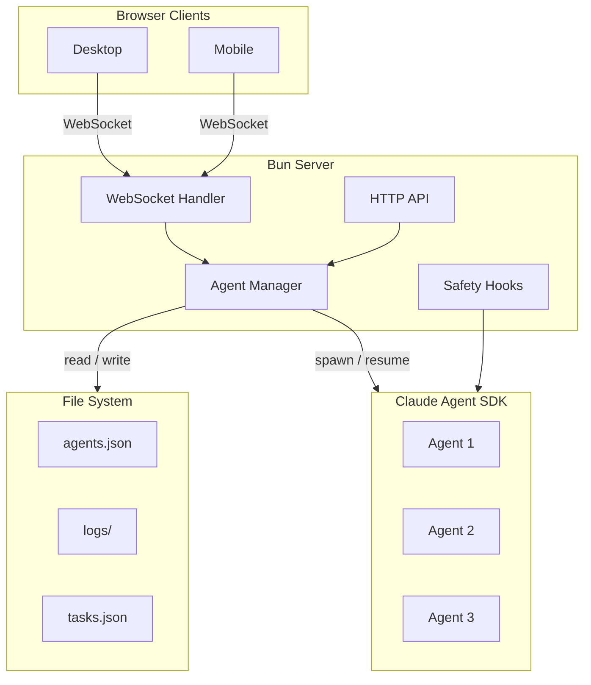

# Bureau Documentation

Welcome to the Bureau documentation. This is your starting point for understanding the system.

## Articles

Long-form, narrative reading.

| Document                                                                                                     | Description                                                |
| ------------------------------------------------------------------------------------------------------------ | ---------------------------------------------------------- |
| [Punching In: Building an Office for AI Agents](../articles/punching-in-building-an-office-for-ai-agents.md) | Deep dive: SDK, agent lifecycle, WebSocket layer, frontend |

## Architecture

Detailed subsystem documentation.

| Document                                                       | Description                                                            |
| -------------------------------------------------------------- | ---------------------------------------------------------------------- |
| [Server Architecture](architecture/server-architecture.md)     | HTTP routing, WebSocket protocol, command dispatch, file serving       |
| [Agent Lifecycle](architecture/agent-lifecycle.md)             | SDK session management, consumer loop, session swapping, state machine |
| [Persistence Layer](architecture/persistence-layer.md)         | File system layout, JSONL logs, session metadata, usage accounting     |
| [Safety Hooks](architecture/safety-hooks.md)                   | PreToolUse hooks: git safety, filesystem, secrets, config protection   |
| [Frontend Architecture](architecture/frontend-architecture.md) | Redux-like store, SVG scene, components, mobile, terminal              |
| [Command & Skill System](architecture/command-skill-system.md) | Slash command registry, skill discovery, priority hierarchy            |

## Feature Design Docs

- [Signed inbound webhooks](features/inbound-webhooks.md)
- [Browser tab sharing](features/browser-sharing.md)

| Document                                                            | Description                                                                  |
| ------------------------------------------------------------------- | ---------------------------------------------------------------------------- |
| [Access & Invites](features/access-and-invites.md)                  | Invite-link auth, sessions, external access toggle, owner-login CLI          |
| [Agent-Built Apps](features/agent-apps.md)                          | Apps agents build and Bureau runs: registry, systemd supervision, app tokens |
| [Conversation Branching](features/conversation-branching-design.md) | Edit past messages to fork conversations                                     |
| [Cronjob System](features/cronjob-system-design.md)                 | Scheduled SDK sessions; per-run transcripts; Cronjobs page                   |
| [Full Feature List](features/full-feature-list.md)                  | Consolidated operator-facing feature inventory                               |
| [Members Team Chat](features/members-chat.md)                       | Humans-only office chat (REST + WebSocket + `/team-chat` panel)              |
| [Multi-Office Isolation](features/multi-office-design.md)           | Multiple isolated workspaces                                                 |
| [Pager](features/pager.md)                                          | Agents and apps page their person; Discord delivery until acked or resolved  |
| [Per-Agent MCP Access](features/per-agent-mcp-access.md)            | Controlling MCP integration access per agent                                 |
| [Plugin Management](features/plugin-management-design.md)           | Plugin UI and lifecycle                                                      |
| [Plugin System](features/plugin-system.md)                          | First-party `beforeTurn` / `afterTurn` hooks around the agent turn loop      |
| [Room Environment & Prompts](features/room-env-prompt-design.md)    | Per-room env vars and prompt hierarchy                                       |
| [Slide Mode](features/slide-mode.md)                                | Conversations as a per-turn deck of model-designed slides                    |
| [Task System](features/task-system-design.md)                       | Shared task board for humans and agents                                      |
| [Named Rooms](features/prompt-named-rooms.md)                       | Custom room names                                                            |
| [Members Chat](features/members-chat.md)                            | Office-wide humans-only team chat (`/team-chat`)                             |

## Investigations & Research

Deep dives into bugs, SDK behavior, and architectural decisions.

[October capability review](investigations/capability-review-2026-10.md) records
the implemented gaps, existing coverage, and integration boundaries.

| Document                                                                     | Description                                                             |
| ---------------------------------------------------------------------------- | ----------------------------------------------------------------------- |
| [Held-Back Messages Bug](investigations/held-back-messages-investigation.md) | Persistent consumer loop fix                                            |
| [Source Feature Gap Options](investigations/source-feature-gap-options.md)   | Accepted, rejected, and deferred source-parity options                  |
| [SDK Investigation](investigations/sdk-investigation.md)                     | SDK v0.2.85 research and findings                                       |
| [SDK Upgrade Assessment](investigations/sdk-upgrade-assessment.md)           | v0.2.86 → v0.2.92 upgrade notes                                         |
| [Security Audit](security-audit.md)                                          | Invite-link auth, session, CSRF/CSWSH, and external-access threat model |
| [Skills Investigation](investigations/skills-investigation.md)               | Claude Code slash command architecture                                  |

## Contributing & Development

| Document                                               | Description                                                                                        |
| ------------------------------------------------------ | -------------------------------------------------------------------------------------------------- |
| [Development Guide](contributing/development.md)       | Quality gate (typecheck / oxlint / prettier / tests / build) and branch protection setup           |
| [Hosting Options](contributing/hosting-options.md)     | Choose local, Tailscale, Funnel, own-domain, VPS, Render, or Kubernetes hosting                    |
| [Hosting Reference](contributing/hosting/reference.md) | Shared external access, invites, provider connections, backup, and health-check notes              |
| [Self-Hosted Setup](contributing/self-hosted.md)       | Keep Bureau running, expose it safely, and install it on mobile                                    |
| [CLAUDE.md](../CLAUDE.md)                              | Developer & agent guide to the codebase — includes the "Shipping a user-visible feature" checklist |

---

## System Architecture

## Quick Navigation by Topic

**Want to understand how agents work?**
→ Start with [Punching In](../articles/punching-in-building-an-office-for-ai-agents.md), then [Agent Lifecycle](architecture/agent-lifecycle.md)

**Adding a new feature?**
→ See the "Shipping a user-visible feature" checklist in [CLAUDE.md](../CLAUDE.md)

**Adding tests or working on the CI gate?**
→ See [Development Guide](contributing/development.md)

**Debugging an SDK issue?**
→ See [SDK Investigation](investigations/sdk-investigation.md) and [SDK Upgrade Assessment](investigations/sdk-upgrade-assessment.md)

**Working on the frontend?**
→ Read [Frontend Architecture](architecture/frontend-architecture.md)

**Understanding the server?**
→ See [Server Architecture](architecture/server-architecture.md)

**Working on slash commands or skills?**
→ See [Command & Skill System](architecture/command-skill-system.md)

**Working on cronjobs / scheduled sessions?**
→ See [Cronjob System](features/cronjob-system-design.md)

**Setting up for development?**
→ See [CLAUDE.md](../CLAUDE.md)
